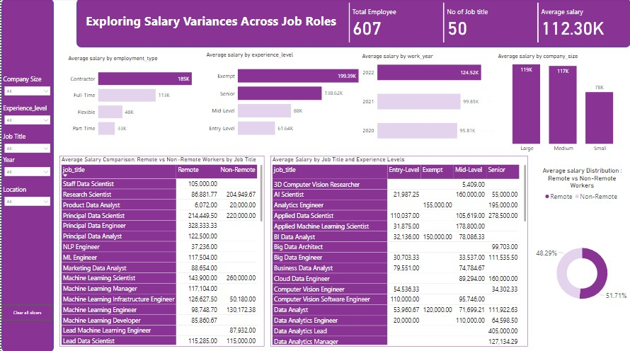

# Exploring Salary Variances Across Job Roles

### **Overview**

This project explores salary variances across different job roles, company sizes, experience levels, employment types, and the impact of remote vs. non-remote work on salaries. The analysis provides actionable insights and recommendations for optimizing salary structures and ensuring equitable pay across the workforce.
### **Statement of the Problem**

In today's competitive job market, understanding the factors that influence salary variances is crucial for both employers and employees. Disparities in compensation can lead to dissatisfaction, high turnover rates, and difficulty in attracting top talent. This project aims to analyze salary data to uncover trends and disparities based on various factors such as job title, company size, experience level, employment type, and the distinction between remote and non-remote work. By identifying these variances, organizations can make informed decisions to ensure fair and competitive compensation practices.

### **Tools Used**

- **Power BI:** For data visualization and interactive dashboard creation.
- **DAX (Data Analysis Expressions):** Used within Power BI to create custom calculations and measures that enhance the analysis.

### **Data Summary**

- **Total Employees Analyzed:** 607
- **Number of Job Titles:** 50
- **Average Salary:** $112,300

### **Key Insights and Recommendations**

1. **Remote vs. Non-Remote Workers:**
   - **Insight:** The distribution of average salaries between remote and non-remote workers is fairly balanced, with remote workers accounting for 48.29% and non-remote workers for 51.71%.
   - **Recommendation:** Investigate further into factors influencing salary differences between remote and non-remote workers.

2. **Total Employees and Job Titles:**
   - **Insight:** A total of 607 employees spread across 50 job titles showcases a diverse workforce with a wide range of roles and responsibilities.
   - **Recommendation:** Ensure diversity in job roles is considered in salary structure decisions.

...

### **Visualizations**

